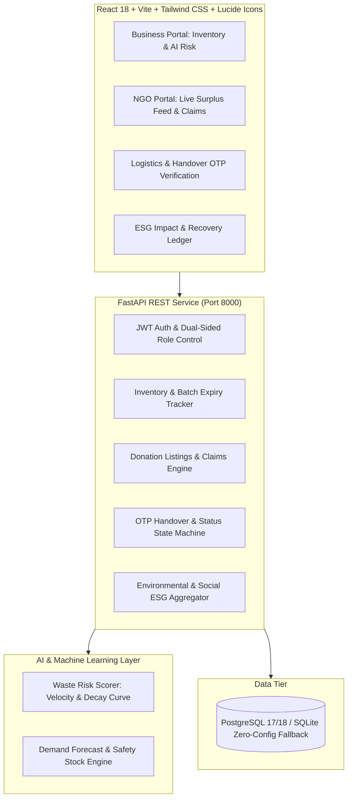

# ResQFood: AI-Based Food Redistribution System

An enterprise-grade, dual-sided, AI-powered food waste reduction and surplus inventory redistribution platform. Built with **FastAPI**, **SQLAlchemy**, **PostgreSQL / SQLite auto-fallback**, **React 18**, **Tailwind CSS**, and **Redux Toolkit**.

---

## 🌟 Key Capabilities

### 1. Dual-Sided Marketplace & Portals
- **Donor Businesses (Supermarkets, Restaurants, Hotels, Caterers):**
  - Real-time inventory tracking with days-to-expiry indicators.
  - Dynamic **AI Waste Risk Scoring (0–100%)** flagging slow-moving perishables.
  - **1-Click Surplus Listing Tool** to transition near-expiry batches into donation listings.
  - **Demand Forecasting & Reordering Optimization** using Economic Order Quantity (EOQ) heuristics to prevent overstock waste.
  - Automated ESG impact logging (diverted food weight, meals rescued, CO₂ emissions prevented).

- **Recipient Organizations (Food Banks, Community Kitchens, Shelters):**
  - **Live Surplus Redistribution Feed** with search & multi-tier filtering (category, storage needs, urgency).
  - Claiming workflow with scheduled pickup window selection and volunteer driver details.
  - **Digital Handover OTP Verification** ensuring verified food rescue.
  - Recipient impact analytics (meals distributed, community beneficiaries reached).

### 2. The AI & Predictive Analytics Layer
- **Perishability & Spoilage Scoring:** Evaluates category decay speed (Dairy, Meat, Produce, Bakery), batch age, shelf-life decay curve, and 14-day sales velocity to classify batches into `Low`, `Medium`, `High`, and `Critical` risk tiers.
- **Replenishment Predictor:** Assesses moving average consumption velocity to suggest optimal reorder dates and quantities, preventing inventory stagnation.
- **Environmental & Social Impact Modeling:**
  - $1 \text{ Meal Equivalent} \approx 0.42 \text{ kg of food}$ (USDA/FAO standard)
  - $1 \text{ kg Diverted Waste} \approx 2.5 \text{ kg CO}_2\text{e}$ greenhouse gas emissions prevented
  - Estimated tax-deductible recovery value calculation ($\$3.50/\text{kg}$)

---

## 🏗️ Architecture



---

## ⚡ Quickstart Guide (Windows)

### Option 1: 1-Click Launch (Recommended)
Open PowerShell in the root project folder and run:
```powershell
.\start_all.ps1
```

### Option 2: Manual Step-by-Step

#### 1. Backend Service
```powershell
cd backend
pip install -r requirements.txt
uvicorn main:app --host 127.0.0.1 --port 8000 --reload
```
API Documentation & Swagger UI: **http://127.0.0.1:8000/docs**

#### 2. Frontend Web Platform
```powershell
cd frontend
npm install
npm run dev
```
Web Application: **http://localhost:5173**

---

## 👥 Pre-Seeded Demonstration Accounts

The platform includes a built-in persona switcher on the top navigation bar, or you can log in with:

| Persona | Organization Name | Email | Password | Role Focus |
| :--- | :--- | :--- | :--- | :--- |
| **Business Donor** | GreenGrocer Supermarket | `supermarket@greenmart.com` | `password123` | Inventory, AI Risk Radar, 1-Click Surplus Listing |
| **Business Donor** | Bistro Good Food | `chef@bistrogood.com` | `password123` | Restaurant surplus management |
| **Recipient NGO** | Hope Community Food Bank | `contact@hopefoodbank.org` | `password123` | Live feed, claiming, scheduled pickups & OTP |
| **Recipient NGO** | City Heart Community Kitchen | `kitchen@cityshelter.org` | `password123` | Soup kitchen meal distribution |

---

## 🧪 Running Automated Tests

A comprehensive test suite verifying the authentication, AI waste risk scoring, donation lifecycle, OTP verification, and impact analytics is included:

```powershell
pytest tests/test_backend.py -v
```

---

## 📊 End-to-End Operational Lifecycle

1. **Intake:** Business tracks batches with batch numbers and expiration dates.
2. **AI Spoilage Detection:** AI engine assigns risk scores (0–100%) and flags batches within 72 hours of expiry.
3. **Surplus Listing:** Business clicks *"Donate Surplus"*, specifying pickup windows and dietary tags.
4. **Broadcast:** Listing appears immediately on the *Live Surplus Feed* for nearby registered NGOs.
5. **Claim & Schedule:** NGO reserves the batch, selects a pickup window, and receives a unique 6-digit handover OTP code.
6. **Handover & Verification:** Business verifies driver OTP at the loading dock. Batch status transitions to *Donated*.
7. **Impact Ledger:** System computes meals rescued, kilograms diverted, and CO₂e prevented into verified ESG reports.
